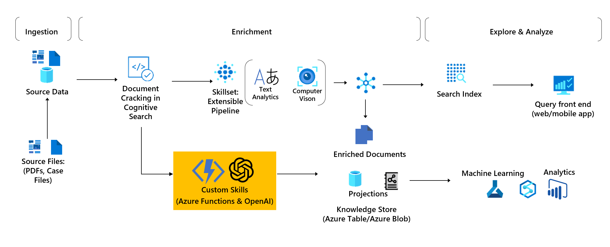

### Hotels sample Azure AI search application with the Azure Python SDK

## Description

The present notebook contains python code that leverages the Azure Python SDK to host, enrich and expose to a search client an example database of Hotels presenting various characteristics.   It leverages Azure blob containers for ingesting a source .json file in a first step. Next, Enrichment uses an indexer composer with a datasource, index and skillset to populate the custom index with augmented content. Search agents can be instantiated to search the index once the indexer has been run.  
The notebook deploys and configures all required resources via the Azure Python SDK.  

## Requirements

Please create a virtual environment with the provided environment.yml and populate an .env file with required Azure microservices keys. You may use the .txt file provided and rename.  

azure-search-documents >= 11.4.0  
azure-storage-blob >= 12.19.0  